Trip plan done for major app development in Android studio

    Create a list of entries, with: (Only the title is mandatory)
      title
      description
      picture
      date and time
       
Uses Picture selector
    
    Subitems in each entry with the same:
      Title
      date time and picture with the option to take a picture or select from the gallery
    
Used glide repository

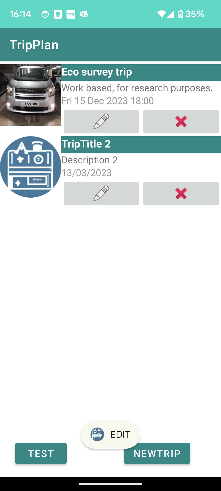
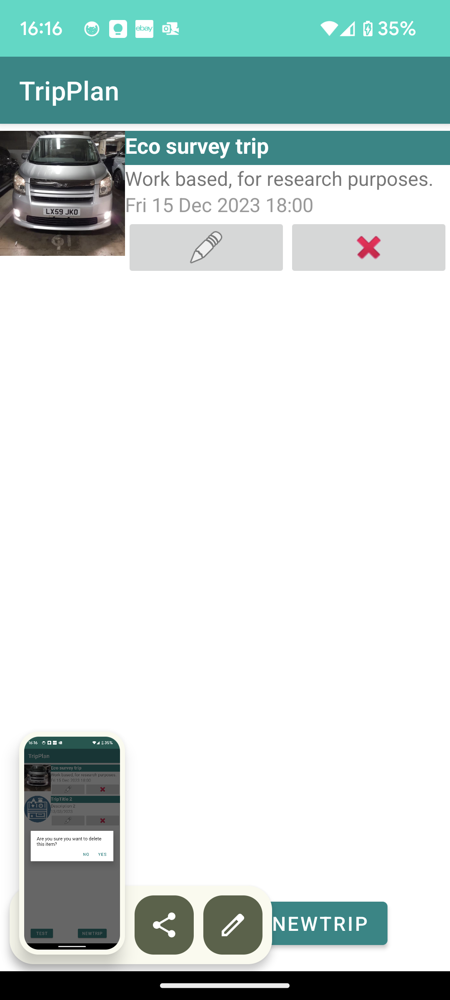
  
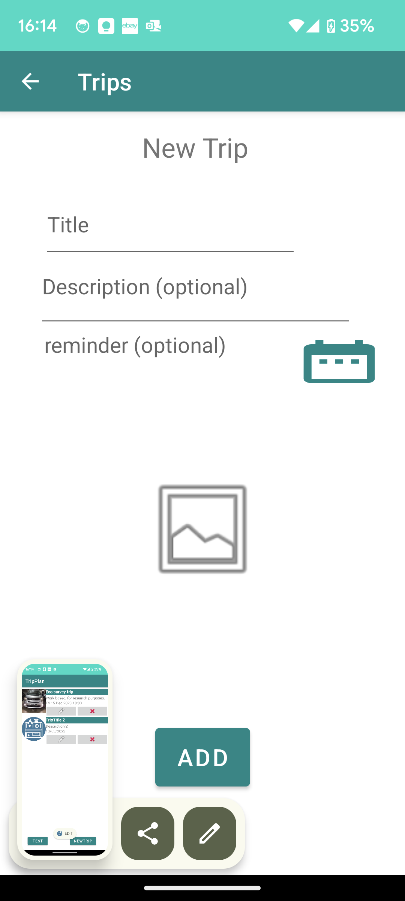
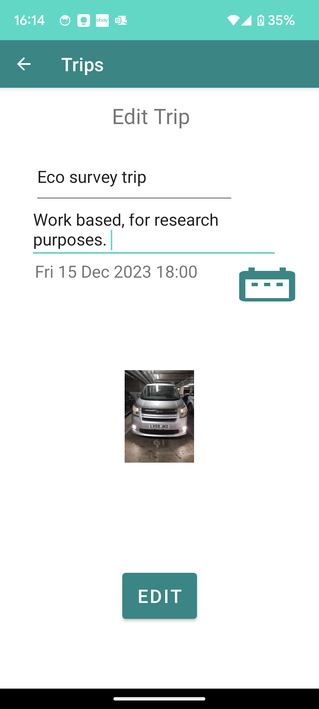
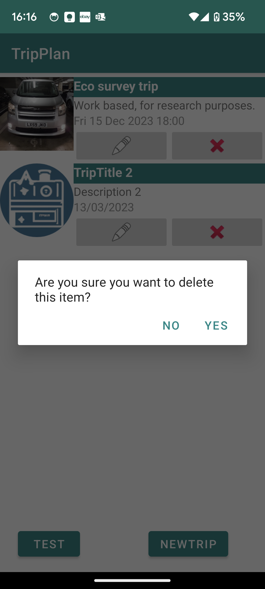

  
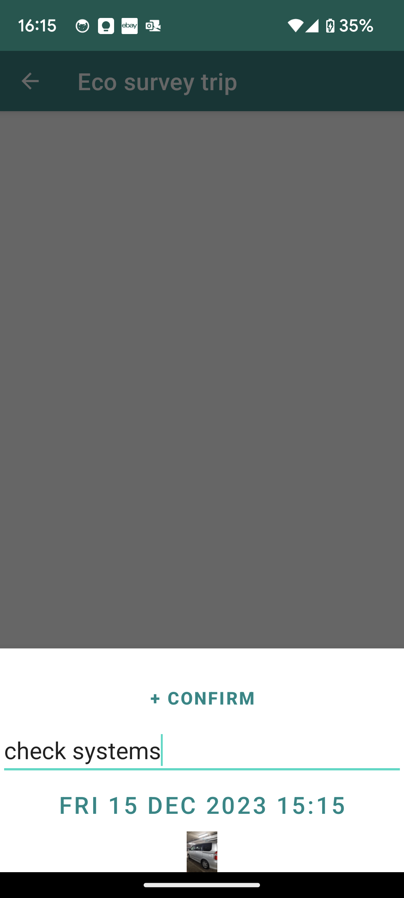
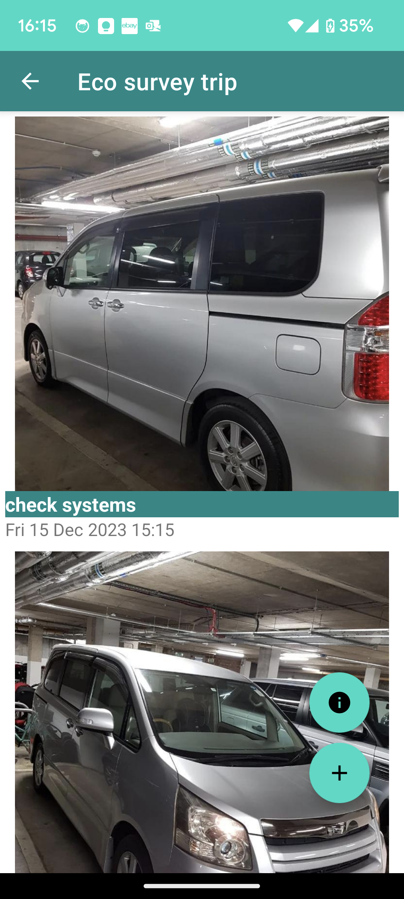

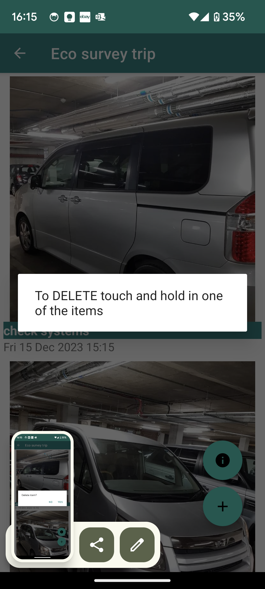  
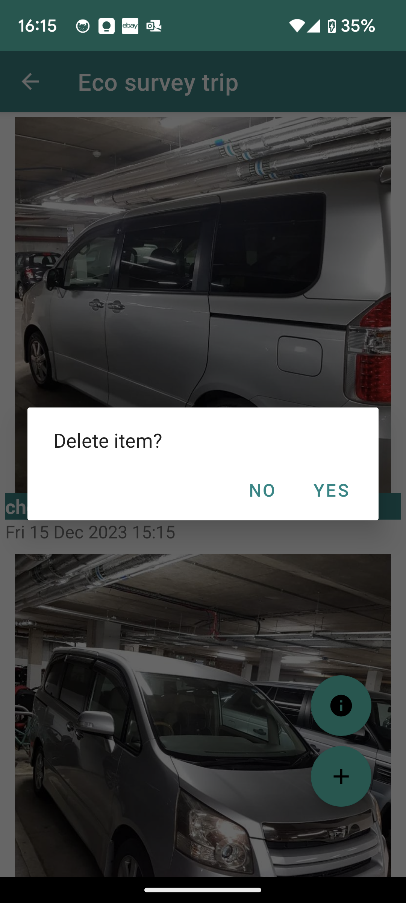

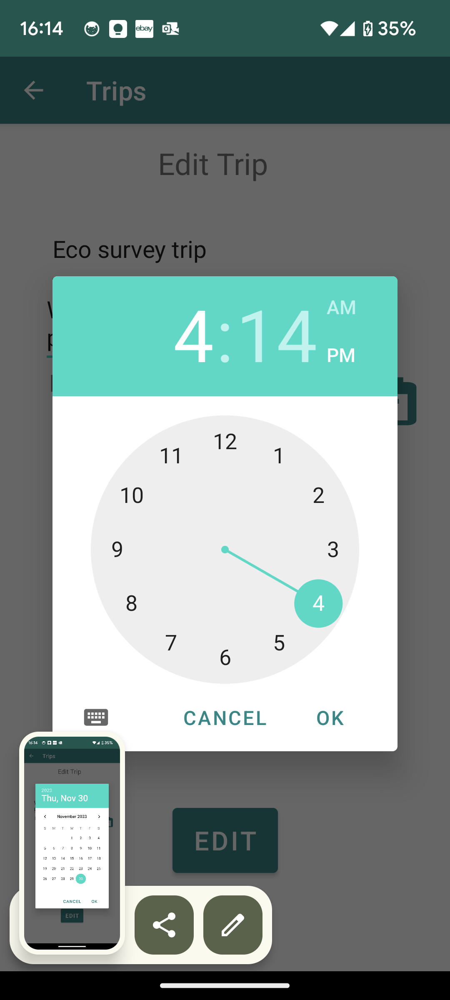
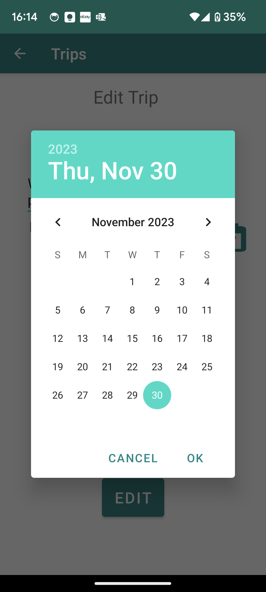

